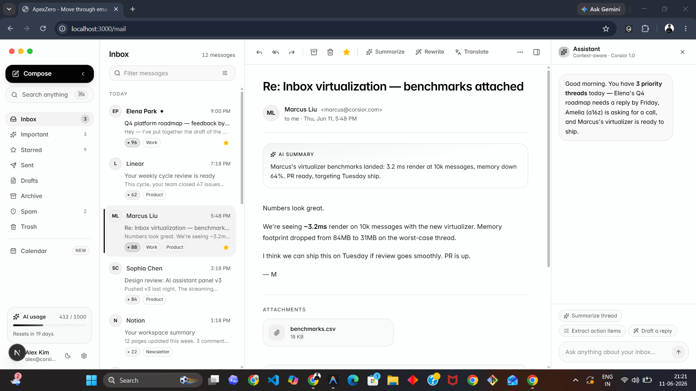

# ApexZero - AI-Native Email & Calendar Workspace

ApexZero is a beautifully minimal, context-aware email and calendar workspace built using **Next.js** and **Tailwind CSS**. It triages your inbox, drafts your replies, and surfaces what matters—before you even ask.

---

## 📸 Interface Preview

### 📬 macOS Style Spacious Email Client



### 📅 Overhauled Interactive Calendar


---

## 🛠️ Redesigned Features

### 1. Unified macOS Mail Dashboard Layout

- **Unified Application Frame**: The email client is wrapped in a seamless, fullscreen macOS application interface (`h-dvh w-screen`) to maximize horizontal and vertical breathing room.
- **Apple Traffic Lights**: Interactive Red, Yellow, and Green control dots sit in the top-left sidebar corner with interactive hover scale transformations.
- **Frosted Glass Columns**: Three vertical columns—Sidebar (`bg-surface/20`), Inbox List (`bg-surface/10`), and Email Reader (`bg-background/30`)—seamlessly fit together with backdrop blur filters and thin borders.
- **Uncolorized Monochromatic Avatars**: Bright colored circles are replaced with high-end monochromatic avatars (`bg-muted` and `text-foreground` with a subtle border) matching the minimalist landing page design.

### 2. Multi-Folder Email Mock Data

- Appended realistic email mock seeds for:
  - **Sent**: User's outbound pitch decks and assets.
  - **Drafts**: Launch press release drafts and rental renewals.
  - **Archive**: Triaging newsletters and trip itineraries.
  - **Spam**: Standard cryptocurrency and pharmacy solicitations.
  - **Trash**: Cancelled calendar invites and generic digests.
- Dynamically filters based on the sidebar selection.

### 3. Interactive Calendar Overhaul

- **Week-by-Week Navigation**: The main week view has a top bar featuring the active month/year range, a "Today" reset button, and prev/next chevrons.
- **MiniMonth Synced Highlighting**: The mini monthly calendar dynamically tracks and highlights the currently active selected cursor day alongside the real current date.
- **Interactive Event Modal**: Click on any empty hour slot or the "+ New event" button to open a premium creation modal pre-filled with the selected day and time slot.
- **Color and Type Customization**: Support for categorizing events (meeting, focus, review, personal) and custom theme colors (violet, blue, amber, emerald, rose, slate).
- **Event Detail Sidebar & Deletion**: Click any event to open its detailed panel showing AI summary notes, locations, and attendees. Custom events can be permanently deleted.
- **Auto-Scroll to Working Hours**: Container automatically positions the scroll viewport at 8:00 AM on load to hide blank early-morning hours.

---

## ⚙️ Tech Stack

- **Framework**: Next.js (App Router, static & dynamic routes)
- **Styling**: Tailwind CSS v4 (Glassmorphism, custom OKLCH tokens)
- **State Management**: Zustand
- **Animations**: Motion (Framer Motion)
- **Icons**: Lucide React
- **Type Safety**: TypeScript

---

## 🚀 Getting Started

1. **Install Dependencies**:

   ```bash
   npm install
   ```

2. **Run Dev Server**:

   ```bash
   npm run dev
   ```

   Open [http://localhost:3000](http://localhost:3000) to see the landing page. Go to `/mail` or `/calendar` to access the dashboard and calendar.

3. **Build Production Bundle**:
   ```bash
   npm run build
   ```
